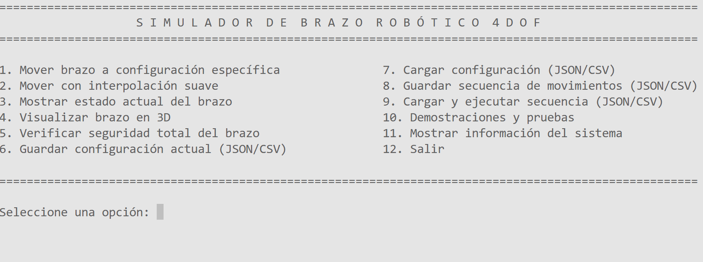
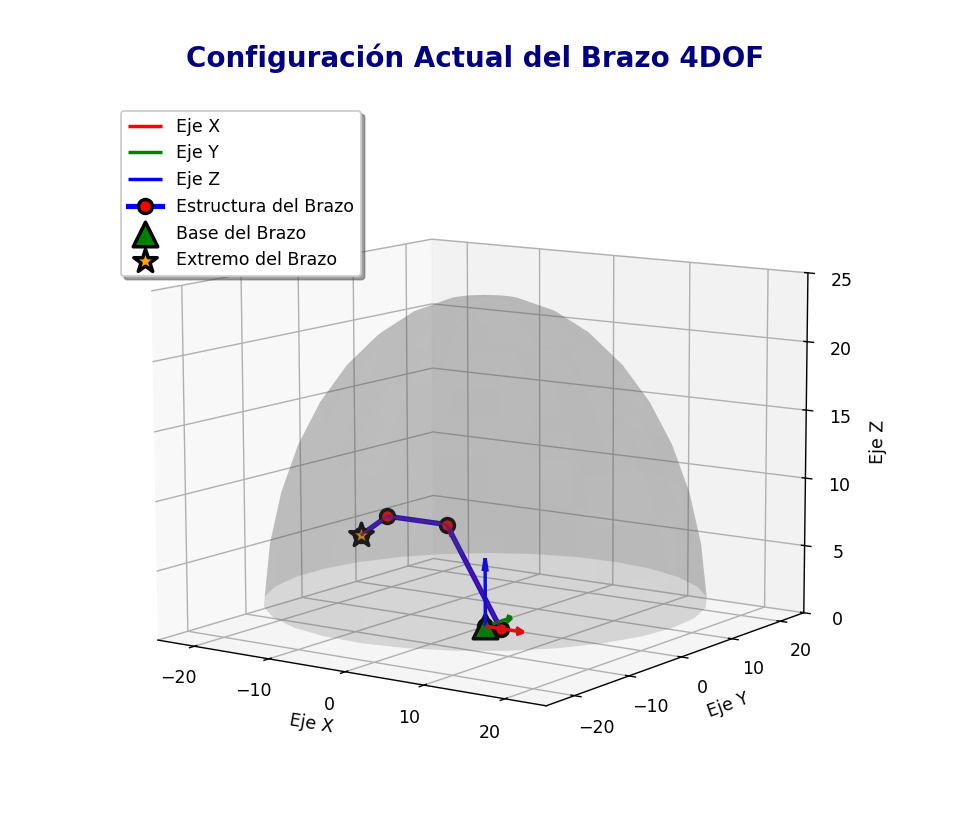

# 4DOF-Robotic-Arm-Simulator
 
Python-based simulator for modeling and visualizing a 4-DOF robotic arm, featuring joint limit validation, collision detection, trajectory management, CSV/JSON persistence, and interactive 3D visualization.
 
## Features
 
- **4 degrees of freedom**: base, shoulder, elbow and wrist, each modeled as an independent rotational joint.
- **Direct kinematics** computed two ways (traditional trigonometric method and homogeneous transformation matrices) to validate correctness.
- **Joint limit validation** for every movement, rejecting out-of-range configurations.
- **Self-collision detection** using distinct collision radii per link, checked both for target configurations and along interpolated paths.
- **Smooth trajectory interpolation** between configurations, with in-route collision checking.
- **3D visualization** of the arm, its coordinate frame, trajectories and workspace using `matplotlib`.
- **Data persistence** in JSON and CSV: save/load single configurations or full movement sequences.
- **Interactive console menu** with demos: rotation planes, collision-aware interpolation, circular trajectories, kinematics comparison, and system self-tests.
## Screenshots
 
<!-- Agrega tus capturas aquí, ver sección "Cómo agregar capturas" en el README de desarrollo -->
 
| Menú principal | Visualización 3D |
|---|---|
|  |  |
 
## Project structure
 
```
4DOF-Robotic-Arm-Simulator/
├── Main.py                          # Entry point
├── Pre_Menu.py                      # Splash screens
├── Menu_s.py                        # Main menu + demos submenu
├── Info_Sistema.py                  # System info screen
├── Funciones_Brazo.py               # Menu handlers: move/status/visualize/safety
├── Funciones_Config.py              # Menu handlers: save/load configuration
├── Funciones_Secuencia.py           # Menu handlers: save/load/execute sequences
├── Funciones_Op10.py                # Demos and system self-tests
├── ClasesBrazoRobotico.py           # BrazoRobotico: kinematics, collisions, trajectories
├── ClasesArticulacionRotacional.py  # Rotational joint class
├── ClasesComponentes.py             # Abstract base class for arm components
├── ClasesVector3D.py                # Minimal 3D vector implementation
├── ClasesVisualizador3d.py          # matplotlib-based 3D visualizer
├── ClasesGestorArchivos.py          # JSON/CSV persistence
├── ClasesConfiguracion.py           # Configuration data model
├── LICENSE
└── README.md
```
 
## Requirements
 
- Python 3.10+ (uses `match/case`)
- `numpy`
- `matplotlib`
```bash
pip install numpy matplotlib
```
 
## Usage
 
```bash
git clone https://github.com/sabasggael/4DOF-Robotic-Arm-Simulator.git
cd 4DOF-Robotic-Arm-Simulator
python Main.py
```
 
Navigate the menu to move the arm, run interpolated trajectories, visualize it in 3D, check safety, and save/load configurations or sequences.
 
### Angular limits
 
| Joint | Range | Notes |
|---|---|---|
| Base | -180° a 180° | Rotación horizontal |
| Hombro | -70° a 70° | 0° = posición vertical |
| Codo | -135° a 135° | |
| Muñeca | -135° a 135° | |
 
## Data persistence
 
Saved configurations and sequences are written to `./datos_robot/` in either JSON (full metadata) or CSV (editable in Excel/Sheets) format. This folder is excluded from version control via `.gitignore`.
 
## License
 
This project is licensed under the MIT License — see [LICENSE](LICENSE) for details.
 
## Author
 
**Gael Sabas** — ESIME Zacatenco, IPN